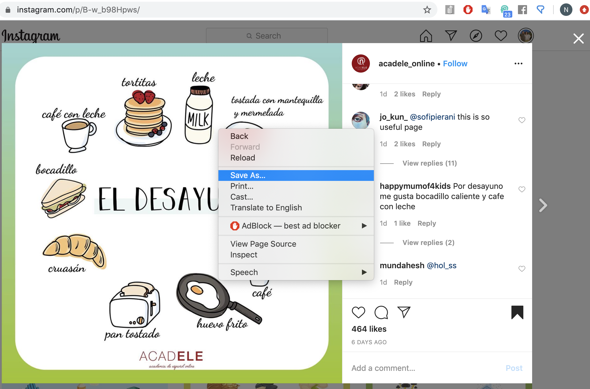
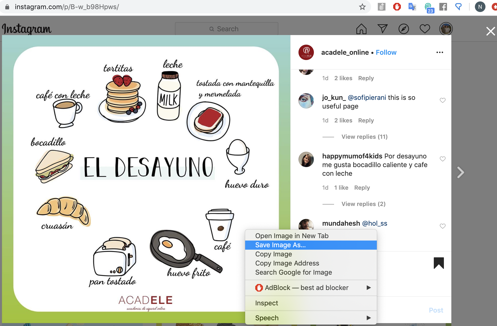
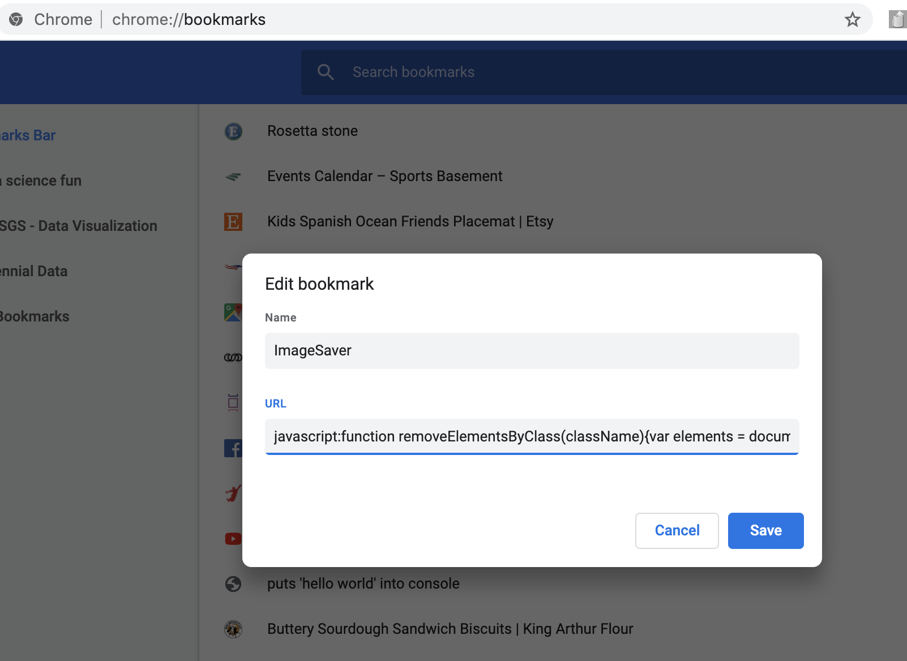

# insta-downloader-bookmark


## This repo explains the steps to saving images from instagram 

**Before:** Right-clicking to Save As --> The instagram photo is not detected as an image- this is the problem!



<!--  -->

<br />
**After:** Save Image As  --> This is now possible!  Follow steps 1 through 5 for similar results. 



<!--  -->


**Step 1:** Create a new bookmark in Google Chrome (any webpage should do)

**Step 2:** Open bookmark manager > edit bookmark

**Step 3:** Change name to ImageSaver; change URL to 

```javascript:function removeElementsByClass(className){var elements = document.getElementsByClassName(className); while(elements.length > 0){ elements[0].parentNode.removeChild(elements[0]); } }; removeElementsByClass('_9AhH0');```

<br />


<!--  -->

<br />
**Step 4:** Open image on instagram, refresh page, and click on the bookmark


**Step 5:** Right-click image and click "Save Image As"

Congratulations, you now have the image saved as a .PNG file!


